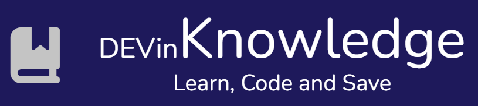
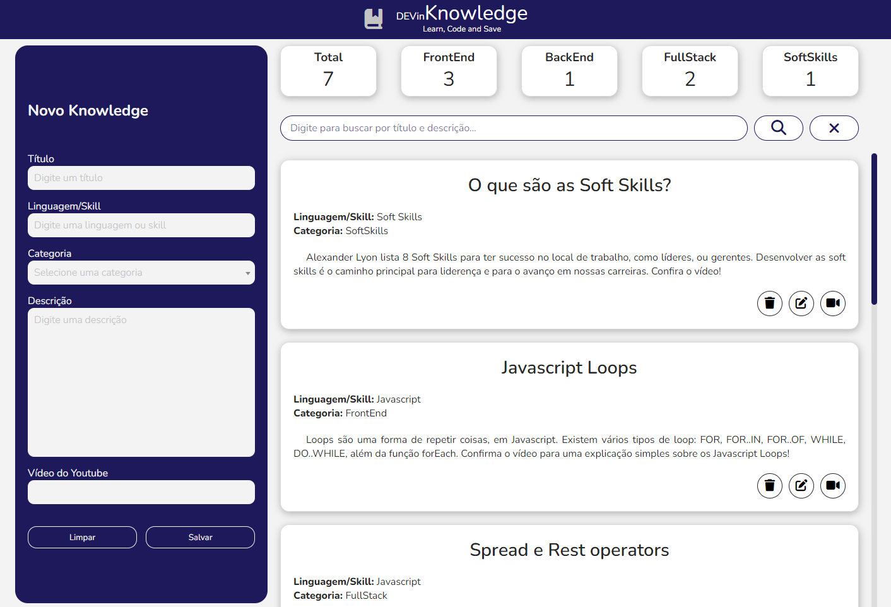
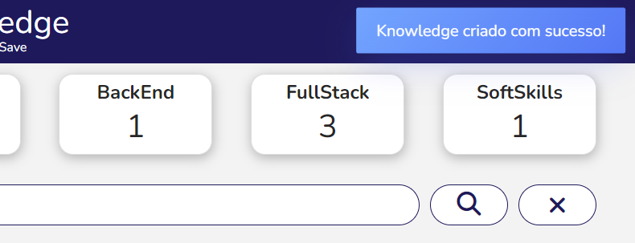
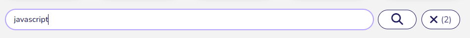
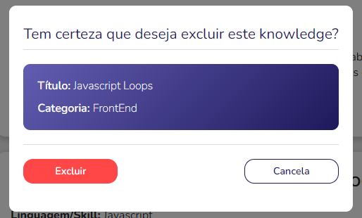

# DEV in Knowledge

<div align='center'>

</div>

<br>

Gerencie seus "**knowledges**" (dicas, curiosidades, conteúdos, explicações, etc.) sobre a área de TI.

Cada **knowledge** adicionado pode conter até 5 informações fornecidas pelo usuário:


- Título<br>
- Linguagem/Skill<br>
- Categoria<br>
- Descrição<br>
- Vídeo do Youtube (opcional)  

<br>

## It's LIVE

Experimente o app [online](https://devin-knowledge.herokuapp.com/)!

<br>

## Funcionalidades

A aplicação permite:

- Salvar novo **knowledge**
- Editar **knowledge**
- Exluir **knowledge**
- Filtrar lista de "**knowledges**" buscando por título e descrição



<br>

## Modo Edição

Três características indicam que a aplicação está em **modo edição**.

- Cor no formulário e no botão de edição do **knowledge** que está sendo editado
- Título do formulário passa a informar "**Editando**"
- Formulário passa a exibit botão **Cancelar** ao invés de Limpar


<br>

## Toasts

Avisos de sucesso nas operações de criação, edição ou exclusão de um **knowledge** aparecem no canto superior direito da tela, na forma de "**toasts**".

<div align='center'>

</div>

<br>

O mesmo sistema é utilizado para informar a quantidade de itens encontrados ao utilizar a barra de pesquisa para filtrar os "**knowledges**".

<div align='center'>

</div>

<br>

## Filtro

Botão de limpar filtro indica a quantidade de "**knowledges**" atualmente filtrados pelo valor digitado no campo de busca (2, no exemplo abaixo).



<br>

## Confirmação de exclusão

Um modal de confirmação gera uma **Promise** que será resolvida quando o usuário confirmar a exclusão ou rejeitada caso ele cancele.

O cancelamento pode ser realizado clicando no botão **cancelar** ou simplesmente clicando "fora" do modal.

<div align='center'>

</div>

<br>

## Responsividade

A aplicação assume 4 possíveis formatos, dependendo da largura da tela.

Além da apresentada na seção **Funcionalidades** (padrão para telas com largura superior a 1366px, tais como FullHD), há os seguintes formatos:

- **Telas HD**: sem cabeçalho | formulário preenche toda a altura da página

<div align='center'>

</div>

<br>

- **Tablets**: formulário se torna barra lateral expansível através de botão "hamburguer"

<div align='center'>

...

</div>

<br>

- **Smartphones**: formulário se torna barra superior expansível através de botão "hamburguer"

<div align='center'>

...

...

</div>

<br>

No formato **Smartphones**, os botões de pesquisa só são mostrados quando o usuário clica na barra de pesquisa | durante esta mesma ação, os cards contadores são escondidos

<div align='center'>

...

...

</div>

## Rodando a aplicação*

Após baixar os arquivos do repositório, instale as dependências rodando o comando:

```
npm install
```

Rode a aplicação através do comando:
```
npm start
```

Dirija-se ao endereço ```localhost:3000``` para utilizar a aplicação.

#### * necessário ter o [Node.js](https://nodejs.org/en/) instalado.